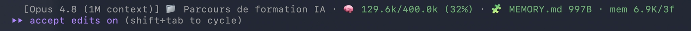
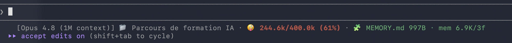

<p align="center">
  
</p>

# 🏺 Clepsydre

> **The tokens are rising — get out fast before the stupidity zone locks you in.**

A Fort Boyard–style water clock for your Claude Code context window — `/clear` before
you're trapped in the context-rot room.

Clepsydre lives in your status line and shows, at every turn, how full your context
window is — with color thresholds that tell you to get out *before* you drift into
context rot (the "stupidity zone").

> **Why "Clepsydre"?** A *clepsydra* is a water clock. In the French TV game *Fort
> Boyard*, a clepsydra slowly fills the room: when it's full, the door locks and you
> are trapped — *"Sors ! Sors ! Sors !"*. Your context window works the same way. It
> fills with tokens, and if you don't step out in time (`/clear`), you stay stuck in
> the context-rot room. Clepsydre is your "get out in time" signal.

## What it shows

```
[Opus 4.8] 📁 my-project ⎇ main · 🧠 65.3k/230.0k (28%) · 🧩 MEMORY.md 4.2K · mem 18.0K/12f
```

- **Model · folder · git branch**
- **Live token usage** vs your working window, colored by the anti-context-rot threshold:
  - 🧠 green — you're fine
  - ⚠️ orange — ≥ 150k, ease off
  - 🤪 red — ≥ 200k, the stupidity zone, `/clear` now
- **Memory weight** — size of `MEMORY.md` (reloaded in full every session) and the memory folder:
  - 🧩 green < 15K · ⚠️ orange 15–25K · 🧨 red ≥ 25K

### Live, in Claude Code

Plenty of headroom — 🧠 green, you're fine:



Deep in the stupidity zone — 🤪 bold red, `/clear` now:



## Install

Works the same on **macOS, Linux and Windows** — it's plain Node.js, and any machine
that runs Claude Code already has Node.

```bash
git clone <your-remote> ~/Dev/clepsydre
cd ~/Dev/clepsydre
node install.mjs          # or node install.mjs --check for a dry-run
```

`install.mjs` is idempotent and touches only `~/.claude/settings.json`. It points your
Claude Code `statusLine` at this repo's `clepsydre.mjs` (absolute path — no symlink, no
`~` expansion, so it's Windows-safe), after making a timestamped `.bak` of your
settings. Your other settings are preserved.

Restart Claude Code to see it.

## Update

Because the status line runs this repo's file directly, `git pull` is enough for script
changes — no re-install, on any OS.

| You change… | Where you edit | On the other machine |
| --- | --- | --- |
| **the gauge** (colors, thresholds, format) | edit `clepsydre.mjs` → `git commit && git push` | `git pull` — done |
| **where it lives** (moved the repo) | — | `git pull` then `node install.mjs` (rewrites the path) |

## The working window

The gauge's denominator is **your** working window — Clepsydre never picks it for you:

1. if you've set `CLAUDE_CODE_AUTO_COMPACT_WINDOW`, the gauge uses that value;
2. otherwise it falls back to the model's real window reported by Claude Code (e.g. 1M
   on Opus 4.8 1M);
3. as a last resort (field absent), it floors at `200000`.

So out of the box the gauge just tracks your real model window — no opinion imposed,
and **no change to when auto-compaction fires**.

### Want a tighter working window?

`CLAUDE_CODE_AUTO_COMPACT_WINDOW` is a real Claude Code setting: it controls **when
auto-compaction triggers**, not just what this gauge displays. Setting it is a
deliberate choice, so Clepsydre leaves it to you. Add it to your own
`~/.claude/settings.json`:

```json
{
  "env": {
    "CLAUDE_CODE_AUTO_COMPACT_WINDOW": "230000"
  }
}
```

Rule of thumb (my own): for coding I don't go past ~230k tokens; quality is meant to
hold up to roughly 300–400k. Pick what fits your context — Clepsydre will show it.

## Requirements

- **Node.js** — already present on any machine running Claude Code (that's what it runs
  on). No `jq`, no `bc`, no bash.
- `git` is optional: the status line keeps working outside a repo — the branch segment
  just disappears.
- macOS, Linux and Windows.
