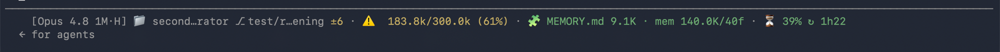

<p align="center">
  
</p>

# 🏺 Clepsydre

[](https://github.com/tpierrain/clepsydre/releases/latest)

> **The tokens are rising — get out fast before the stupidity zone locks you in.**

**An always-on gauge for your context window, built for the Claude Code CLI.** It
lives in your status line and shows — every turn, without you asking — how full your
context is, so you can `/clear` at exactly the right moment.

![Clepsydre status line, red tier: [Opus 4.8 1M·H] folder second…rator, branch test/r…ening ±6, 262.3k/300.0k (87%) deep in the 🤪 stupidity zone, MEMORY.md 9.1K, mem 140.0K/40f, 2% until auto-compact](assets/statusline-red.png)

> **Why "Clepsydre"?** A *clepsydra* is a water clock. In *Fort Boyard*, it slowly fills
> the room until the door locks and you're trapped — *"Sors ! Sors ! Sors !"*. Your
> context window works the same way: it fills with tokens, and if you don't step out in
> time (`/clear`), you stay stuck in the context-rot room. Clepsydre is your "get out in
> time" signal.

**[INSTALL CLEPSYDRE NOW](#install)**

## The problem

In the Claude Code CLI, context engineering has a blind spot: the window fills up turn
after turn, but nothing keeps it in view — and **you can't steer what you can't see.**

- **Checking costs you.** Hammering `/context` to find where you stand wastes time — and
  once MCP servers are loaded, each call carries a huge call stack. Clepsydre shows it
  for you, always. No call needed.
- **Overflow builds silently, on two fronts.** Your context window fills with tokens
  (🧠→⚠️→🤪) *and* `MEMORY.md` — reloaded in full every session — quietly bloats and rots
  your context (🧩→⚠️→🧨). Clepsydre watches both, so you see it coming.
- **The right moment is narrow.** `/clear` too early and you throw away useful context;
  too late and you're already stupid. A live gauge lets you time it.

## What you see

```
[Opus 4.8 1M·H] 📁 my-project ⎇ main ↑2 ↓1 ±8 · 🧠 65.3k/230.0k (28%) · 🧩 MEMORY.md 4.2K · mem 18.0K/12f · ⏳ 23% ↻ 2h13
```

Here it is live, with every segment on screen:

![Clepsydre status line, all segments: [Opus 4.8 1M·H] folder second…rator, branch test/r…ening ±6, 126.0k/300.0k (42%) green, MEMORY.md 9.1K, mem 140.0K/40f, rate window 39% resets in 1h23](assets/statusline-overview.png)

- **Model · window size · reasoning effort · folder · git branch** — the model bracket packs
  three things: the model name, the **context window it exposes** as a compact badge (e.g. `1M`,
  `200k`), and the **effort** level as a single glyph (`·L`/`·M`/`·H`/`·xH`/`·MAX`). So `[Opus 4.8 1M·H]`
  = Opus 4.8, a 1M-token window, thinking at **high**. The size is the real number Claude Code reports
  for the model — never guessed, never a hardcoded table. The effort tracks live `/effort` changes,
  and the bracket drops whatever doesn't apply.
- **Live token usage** vs your working window, colored by the anti-context-rot threshold:
  - 🧠 green — you're fine
  - ⚠️ orange — ≥ 150k, ease off
  - 🤪 red — ≥ 200k, the stupidity zone, `/clear` now
- **Memory weight** — size of `MEMORY.md` (reloaded in full every session) and the memory folder:
  - 🧩 green < 15K · ⚠️ orange 15–25K · 🧨 red ≥ 25K
- **5-hour rate window** (Pro/Max plans) — how much of it you've burned, and when it resets; pinned
  far right, so it's the first thing to clip on a narrow terminal:
  - ⏳ green < 70% · ⚠️ orange 70–90% · ⌛ red ≥ 90%

Plenty of headroom — 🧠 green, you're fine:


Past the warn threshold — ⚠️ orange, ease off before it gets worse:



Deep in the stupidity zone — 🤪 bold red, `/clear` now:


### How to read it, piece by piece

Reading the example line above from left to right:

| Piece | Means |
| --- | --- |
| `[Opus 4.8 1M·H]` | The **model** currently answering you. `1M` is the **context window it exposes** (`1M`, `200k`, …) — the real size Claude Code reports for the model, compacted to a short badge; *on by default, opt-out* via `CLEPSYDRE_MODEL_MAX` (see [model window size](#model-window-size-on-by-default-opt-out)). Never guessed, never a hardcoded table. `·H` is the **reasoning effort** compacted to a single glyph after a middot: `·L`/`·M`/`·H`/`·xH`/`·MAX` (here *high*) — *on by default, opt-out* (see [reasoning effort](#reasoning-effort-on-by-default-opt-out)); tracks live `/effort` changes. The bracket drops whatever doesn't apply (`[Opus 4.8]` when there's neither). |
| `📁 my-project` | The **folder** (project) you're working in. Capped at 12 chars on a narrow terminal by default (25 with no git branch), widening on wider terminals (middle ellipsis); tune or disable with `CLEPSYDRE_FOLDER_MAX` (see [bounding a long folder name](#bounding-a-long-folder-name-on-by-default)). |
| `⎇ main` | The current **git branch** (`⎇` is the git branch symbol). Capped at 12 chars on a narrow terminal by default, widening on wider terminals (middle ellipsis); tune or disable with `CLEPSYDRE_BRANCH_MAX` (see [bounding a long branch name](#bounding-a-long-branch-name-on-by-default)). Outside a repo, this whole part just disappears. |
| `↑2 ↓1 ±8` | **Git state** — *on by default, opt-out* (see [git counts](#git-aheadbehinddirty-counts-on-by-default-opt-out)). `↑2` = 2 local commits **ahead** of the remote (to push); `↓1` = 1 commit **behind** (to pull); `±8` = 8 files with **uncommitted changes** (your edits + brand-new files). Each shows only when it isn't zero — a clean, in-sync repo shows nothing here. |
| `·` | Just a **separator** between groups. |
| `🧠 65.3k/230.0k (28%)` | **The one that matters most: how full the context window is.** 65.3k tokens used out of a 230.0k working window = 28%. The icon is a traffic light: 🧠 green (fine) → ⚠️ orange (ease off) → 🤪 red (the "stupidity zone" — `/clear` now). |
| `🧩 MEMORY.md 4.2K` | Size of your **`MEMORY.md`** file — it's reloaded *in full every session*, so it eats context; the icon warns as it grows (🧩 → ⚠️ → 🧨). |
| `mem 18.0K/12f` | The **whole memory folder**: `18.0K` total across every memory file, `12f` = **12 files**. Reads on demand, so it doesn't cost context the way `MEMORY.md` does — this is just its footprint on disk. |
| `⏳ 23% ↻ 2h13` | Your **5-hour rate window** (Pro/Max plans) — *on by default, opt-out* (see [rate window](#the-5-hour-rate-window-on-by-default-opt-out)). `23%` of the window already used, `↻ 2h13` until it resets. ⏳ green → ⚠️ orange (≥ 70%) → ⌛ red (≥ 90%). **Pinned far right** ([ADR 0002](maintainers/docs/adr/0002-segment-ordering-encodes-priority.md)) — first to clip on a narrow terminal, so it never squeezes the token gauge. Not on a subscription plan? The segment simply doesn't show. |

## Why it matters

Context doesn't just fill — it **degrades as it fills** (*context rot*). As the context
grows, the agent forgets, confuses, and hallucinates more. This is about **size, not
position**: the old "info in the middle gets read worse" effect is outdated on frontier
models — what stays measured today is degradation tied to context **size**.

**Where the trouble starts (~150–200K).** It's not exact science — it's model-dependent
and opinions differ — but heavy users find that past ~150–200K tokens, coding quality
starts to slip. Treat it as a prudent comfort zone, not a hard wall. (Chroma's
[Context Rot report](https://research.trychroma.com/context-rot) puts *clear* degradation
nearer ~300–400K on 1M models, so ~150–200K stays conservative for reliable coding.)

**The 1M-window trap.** Anthropic shipped 1M context to analyse **big documents** without
auto-compacting from the start — *not* to code inside all of it. Because you *can* doesn't
mean you *should*: stay under ~150–200K and flee the stupidity zone.

## Why timing beats compaction

Auto-compaction is a guardrail — but left unguarded,
**especially on 1M windows, it fires far too late**, when you're already deep in the
stupidity zone. The summary that then seeds every later turn is written by "someone drunk,
tired, hallucinating," and your whole subsequent working context inherits that degraded
state — compounding harm. Clepsydre's value: **see it coming and `/clear` at the *right*
time**, before auto-compaction rescues you too late.

**Keep memory lean — pointers, not copies.** `MEMORY.md` is reloaded in full every
session. Forget to tell your harness to store *pointers to the plan* rather than the plan
itself, and it will re-paste the whole thing every time you ask "can I `/clear`?" —
bloating and rotting context. The 🧩→⚠️→🧨 tiers catch exactly that.

> More, in Thomas's own words (French): *["Comment éviter de devenir zinzin (votre IA, et
> vous un peu aussi)"](https://medium.com/@tpierrain/comment-%C3%A9viter-de-devenir-zinzin-votre-ia-et-vous-un-peu-aussi-a704af30455a)*
> and *["Des pointeurs, pas des copies, banane"](https://medium.com/@tpierrain/des-pointeurs-pas-des-copies-banane-56c9d197b80b)*.

## Install

### The easy way — let Claude do it

You're already in the Claude Code CLI, so let it install Clepsydre for you. Paste this to
Claude:

```text
Install Clepsydre on my machine by following its README
(https://github.com/tpierrain/clepsydre). First ask me which directory to clone it
into, suggesting my home directory (e.g. ~/clepsydre) as the default. Then, before
touching anything, explain what you're going to do and where — which files you'll
create or change — and wait for my go-ahead.
```

Claude asks **where** to clone it (your home directory, e.g. `~/clepsydre`, is a safe
default), then walks you through the plan (clone the repo, then merge a `statusLine` entry
into `~/.claude/settings.json` after backing it up). Once you approve, it runs the
installer and tells you to restart Claude Code.

### The manual way

Works the same on **macOS, Linux and Windows** — it's plain Node.js, and any machine that
runs Claude Code already has Node.

Clone it wherever you like — pick a **stable** spot, since the status line runs from
there. Your home directory is a safe default (avoid a folder you might move or wipe):

```bash
git clone https://github.com/tpierrain/clepsydre.git ~/clepsydre
cd ~/clepsydre
node install.mjs          # or node install.mjs --check for a dry-run
```

`install.mjs` is idempotent and touches only `~/.claude/settings.json`. It points your
Claude Code `statusLine` at this repo's `clepsydre.mjs` (absolute path — no symlink, no
`~` expansion, so it's Windows-safe), after making a timestamped `.bak` of your settings.
Your other settings are preserved.

Restart Claude Code to see it.

## Update

Your status line runs this repo's file directly, so **`git pull` is all it takes** to get
new versions — no re-install, on any OS. Pull, restart Claude Code, and you're on the latest.

| What you want | What to do |
| --- | --- |
| **Get the latest Clepsydre** (fixes, new segments) | `git pull` in the repo, then restart Claude Code |
| **Tune your colors, thresholds or git counts** | set the `CLEPSYDRE_*` env vars in your own `settings.json` — it takes effect on the next render, no pull needed (see [Customize the color thresholds](#customize-the-color-thresholds)) |
| **Moved the repo to another folder** | `git pull`, then `node install.mjs` again (it rewrites the path Claude Code points at) |

## The working window

The gauge's denominator is **your** working window — Clepsydre never picks it for you:

1. if you've set `CLAUDE_CODE_AUTO_COMPACT_WINDOW`, the gauge uses that value;
2. otherwise it falls back to the model's real window reported by Claude Code (e.g. 1M on
   Opus 4.8 1M);
3. as a last resort (field absent), it floors at `200000`.

So out of the box the gauge just tracks your real model window — no opinion imposed, and
**no change to when auto-compaction fires**.

### Want a tighter working window?

`CLAUDE_CODE_AUTO_COMPACT_WINDOW` is a real Claude Code setting: it controls **when
auto-compaction triggers**, not just what this gauge displays. Setting it is a deliberate
choice, so Clepsydre leaves it to you. Add it to your own `~/.claude/settings.json`:

```json
{
  "env": {
    "CLAUDE_CODE_AUTO_COMPACT_WINDOW": "230000"
  }
}
```

Rule of thumb (my own): for coding I don't go past ~230k tokens; quality is meant to hold
up to roughly 300–400k. Pick what fits your context — Clepsydre will show it.

## Customize the color thresholds

The tier colors flip at sensible defaults, but **changing a threshold is configuration,
not code** — so you set it in your own `settings.json`, never by editing `clepsydre.mjs`
(that file stays identical for everyone, so `git pull` keeps working). Six optional env
vars, each defaulting to today's behavior:

| Env var | Default | Tier it moves |
| --- | --- | --- |
| `CLEPSYDRE_TOKEN_WARN` | `150000` | 🧠 → ⚠️ (ease off) |
| `CLEPSYDRE_TOKEN_CRAZY` | `200000` | ⚠️ → 🤪 (stupidity zone) |
| `CLEPSYDRE_MEM_WARN` | `15360` | 🧩 → ⚠️ (`MEMORY.md`, bytes) |
| `CLEPSYDRE_MEM_ROT` | `25600` | ⚠️ → 🧨 (`MEMORY.md`, bytes) |
| `CLEPSYDRE_RATE_WARN` | `70` | ⏳ → ⚠️ (5h window, %) |
| `CLEPSYDRE_RATE_HIGH` | `90` | ⚠️ → ⌛ (5h window, %) |

**Where to set them:**

- **Everywhere on this machine** → your global `~/.claude/settings.json`.
- **For one project only** → that project's `.claude/settings.json` (Claude Code gives the
  project file precedence over the global one).

```json
{
  "env": {
    "CLEPSYDRE_TOKEN_WARN": "180000",
    "CLEPSYDRE_TOKEN_CRAZY": "250000"
  }
}
```

Set only the ones you care about; the rest keep their defaults. Anything empty,
non-numeric, or non-positive is ignored, and a pair whose `WARN` isn't below its
`CRAZY`/`ROT` quietly reverts to its defaults — a bad value can never break the gauge.

## Git ahead/behind/dirty counts (on by default, opt-out)

A compact git state suffix shows after the branch, out of the box:

```
[Opus 4.8] 📁 my-project ⎇ main ↑2 ↓1 ±8 · 🧠 65.3k/230.0k (28%) · …
```

- **↑2** commits ahead of upstream (to push) · **↓1** behind (to pull) · **±8** uncommitted
  changes (tracked edits + untracked files). Each part shows only when non-zero; a clean,
  in-sync repo adds nothing.

| Env var | Default | What it does |
| --- | --- | --- |
| `CLEPSYDRE_GIT_COUNTS` | *(on)* | `0` (or `false`/`no`/`off`) hides the ↑↓± suffix and falls back to a cheap branch-only read |

To **opt out** — e.g. on a very large monorepo — set it in the same `"env"` block, globally
or per-project (see above):

```json
{
  "env": {
    "CLEPSYDRE_GIT_COUNTS": "0"
  }
}
```

**Why on by default, and when to opt out.** The counts need `git status`, which scans the
whole working tree *on every render*. We benchmarked that scan: on a normal repo it's ~0 ms,
and even on the Linux kernel (~95k files) it stays around ~0.24 s warm — cheap enough that the
counts are worth having on by default (full numbers and rationale in
[`maintainers/docs/adr/0001-git-counts-default-on.md`](maintainers/docs/adr/0001-git-counts-default-on.md)).
On a genuinely huge monorepo where that per-render cost bites, opt out with `=0` and the branch
still shows via a cheap ref read. Either way it's robust: if git ever fails with the counts on,
the line falls back to the plain branch and the rest of the status line is never affected.

## Bounding a long branch name (on by default)

A long branch name sits *left* of the token gauge, so on a narrow terminal it would push the
gauge — Clepsydre's crown jewel — rightward and off-screen. To stop that, the branch is **capped
at 12 characters on a narrow terminal by default** — and the cap **widens automatically on a wider
terminal** (see [responsive to your terminal width](#responsive-to-your-terminal-width-on-by-default)
below). Normal names (`main`, `feature/foo`) show in full; only a genuinely long one is shortened:

```
# a 36-char branch, default cap
[Opus 4.8] 📁 my-project ⎇ featur…-name · 🧠 65.3k/230.0k (28%) · …
```

- The cap is a **total character count**, ellipsis included. A branch within it shows unchanged; a
  longer one is clipped with an ellipsis **in the middle**, keeping both the distinctive **head**
  (`feature/…`) and **tail** (`…-name`) — the parts a tail-only cut would throw away.

| Env var | Default | What it does |
| --- | --- | --- |
| `CLEPSYDRE_BRANCH_MAX` | `12` | A positive integer sets the cap (total chars, middle ellipsis). `0` (or `false`/`no`/`off`) disables it → the branch shows **in full** (handy on a wide screen). |

```json
{
  "env": {
    "CLEPSYDRE_BRANCH_MAX": "0"
  }
}
```

> Why bounded by default? The token gauge is the whole point of Clepsydre, and it must never be
> evicted by a secondary segment growing to its left. See
> [ADR 0002](maintainers/docs/adr/0002-segment-ordering-encodes-priority.md) for how segment
> ordering encodes this priority.

## Bounding a long folder name (on by default)

The `📁` folder name sits *left* of the token gauge too, so a long project name (say
`second-brain-generator`) pushes the gauge the same way a long branch does. Its default cap is
**conditional on whether a git branch is also shown**: **12 characters with a branch** (it then
shares the space left of the gauge with the branch, so both stay tight), **25 without** (a non-git
working dir — the folder owns that whole space alone, so it can breathe). These caps too **widen
automatically on a wider terminal** (see [responsive to your terminal width](#responsive-to-your-terminal-width-on-by-default)
below). Normal names (`clepsydre`, `my-project`) show in full; only a long one is shortened:

```
# a 22-char folder, inside a git repo (branch shown) → 12-char cap
[Opus 4.8] 📁 second…rator ⎇ main · 🧠 65.3k/230.0k (28%) · …
```

- Same rule as the branch: a **total character count**, ellipsis included, clipped in the **middle**
  so the distinctive **head** and **tail** both survive.

| Env var | Default | What it does |
| --- | --- | --- |
| `CLEPSYDRE_FOLDER_MAX` | `12` (`25` with no git branch) | A positive integer sets the cap (total chars, middle ellipsis) and overrides the conditional default. `0` (or `false`/`no`/`off`) disables it → the folder shows **in full**. |

```json
{
  "env": {
    "CLEPSYDRE_FOLDER_MAX": "0"
  }
}
```

> Same rationale as the branch cap — a secondary, variable-length segment must never evict the
> token gauge to its left ([ADR 0002](maintainers/docs/adr/0002-segment-ordering-encodes-priority.md)).

## Responsive to your terminal width (on by default)

The folder and branch caps above are **tight on purpose only when your terminal is narrow** — where
space is scarce and the gauge really is at risk. On a **wider** terminal there is room to spare, so
Clepsydre **widens the names automatically** and stops truncating for nothing: `second…rator` becomes
`second-brain-generator` once it fits.

It does this by spending the *actually available* width, read from the terminal's `COLUMNS`: it
measures how many columns **everything else** takes — the model badge, the token gauge, the git
counts, the memory segment **and the rate window** — and hands **whatever is left** to the folder and
branch names. If both fit, you see them in full; if not, the names shrink by exactly as much as the
width demands — and no more.

- **Everything else stays visible — the names are the only thing that shrinks.** Because the folder
  and branch are sized from what's left after *the whole rest of the line*, they can **never** push
  the gauge, the memory segment **or the rate window** off-screen — not even with pathologically long
  names. Under pressure the **branch is kept and the folder yields first** (it's the more redundant of
  the two — you usually know which project you're in), and each keeps a small floor so neither
  vanishes. On a genuinely tiny terminal, where even the floored names would just become unreadable
  stubs, they **collapse to their icons** instead — `📁 ⎇ ±6` (folder icon + branch symbol + git
  status), or just `📁` outside a repo — freeing their whole width so the gauge, memory *and* rate all
  stay visible far lower. Only below *that* does the right-most rate window get clipped first — the
  gauge is always the last to go.
- **Zero regression, zero config.** If the width is unknown (`COLUMNS` absent or unreadable), you get
  exactly today's fixed caps (12 / 25). Nothing to set up.
- **Your explicit caps still win.** A `CLEPSYDRE_BRANCH_MAX` / `CLEPSYDRE_FOLDER_MAX` you set (including
  `0` to show the name in full) overrides the automatic sizing for that segment.
- **A small width reserve keeps the tail safe.** The status line doesn't get the *whole* terminal
  width — your `statusLine.padding` indents it, and Claude Code adds its own ellipsis when a line is too
  long. Clepsydre holds back a few columns (`CLEPSYDRE_WIDTH_RESERVE`, default `8`) so the rate window
  is never clipped for it. Bump it if you use a large padding, or set `0` to reclaim every column.
- **Adapts on the next render, not live.** Resize the terminal and the new width is picked up on the
  **next** status-line render (each turn), not mid-drag — so right after a resize the first line may
  look tight for a moment, then settle.

See [ADR 0006](maintainers/docs/adr/0006-responsive-width-caps.md) for the design.

## Model window size (on by default, opt-out)

Clepsydre shows the **context window the current model exposes** as a compact badge inside the
`[model]` bracket, right after the name:

```
[Opus 4.8 1M·H] 📁 my-project ⎇ main · 🧠 65.3k/300.0k (22%) · …
```

- The badge is the model's real window (`1M`, `200k`, …), read from the size **Claude Code reports in
  the payload** (`context_window_size`) — the actual number, not the marketing name. A standard model
  is just named `Sonnet 4.6`, yet it genuinely exposes 200 000 tokens, so we can still show `200k`.
- **Never guessed, never a hardcoded `model → size` table** — which would rot the moment Anthropic
  reshuffles its lineup or renames a tier. If Claude Code reports no size, the badge is simply
  omitted. This keeps it honest and future-proof.
- It's the model's **exposed ceiling**, distinct from the `/…` **working window** in the token gauge
  (which you narrow with `CLAUDE_CODE_AUTO_COMPACT_WINDOW` — see [the working
  window](#the-working-window)). So `1M` next to `65.3k/300.0k` reads: *a 1M-capable model, worked
  within a 300k window, 65.3k used.* When you haven't narrowed it, the badge simply matches the
  gauge's denominator.

| Env var | Default | What it does |
| --- | --- | --- |
| `CLEPSYDRE_MODEL_MAX` | *(on)* | `0` (or `false`/`no`/`off`) hides the size badge |

```json
{
  "env": {
    "CLEPSYDRE_MODEL_MAX": "0"
  }
}
```

> Why glued to the model? The window size *qualifies the model* — it belongs with its identity, and
> staying a short left-anchored badge keeps the token gauge protected from the right-edge clip. See
> [ADR 0005](maintainers/docs/adr/0005-model-window-badge-from-real-info-only.md) for why we only ever
> surface real, reported info here — never a guess.

## Reasoning effort (on by default, opt-out)

The model's current reasoning-effort level rides **inside the `[model]` bracket**, compacted to a
single glyph after a middot, out of the box:

```
[Opus 4.8·H] 📁 my-project ⎇ main · 🧠 65.3k/230.0k (28%) · …
```

- The level is read straight from Claude Code's session data — it reflects live `/effort` changes
  with no extra work or API calls — and is compacted to one glyph so it stays anchored to the model
  and can never push the token gauge off a narrow terminal:

  | Level | Glyph |
  | --- | --- |
  | `low` | `·L` |
  | `medium` | `·M` |
  | `high` | `·H` |
  | `xhigh` | `·xH` |
  | `max` | `·MAX` |

- The bracket stays **bare** (`[Opus 4.8]`) when the current model has no effort setting (the field
  is simply absent), so it's never a fabricated or stale value.

> Why glued to the model rather than a standalone segment? Effort is *how hard this model is
> thinking* — it belongs with the model's identity, and staying a single left-anchored glyph keeps
> the context-window gauge (the whole point of Clepsydre) protected from the right-edge clip. See
> [ADR 0002](maintainers/docs/adr/0002-segment-ordering-encodes-priority.md).

| Env var | Default | What it does |
| --- | --- | --- |
| `CLEPSYDRE_EFFORT` | *(on)* | `0` (or `false`/`no`/`off`) hides the effort glyph (bare bracket) |

To **opt out**, set it in the same `"env"` block, globally or per-project (see above):

```json
{
  "env": {
    "CLEPSYDRE_EFFORT": "0"
  }
}
```

## The 5-hour rate window (on by default, opt-out)

On Claude Pro/Max subscription plans, usage is metered over a rolling **5-hour window**.
Clepsydre shows where you stand, out of the box — **pinned to the far right** of the line, so
it's the first segment the terminal clips on a narrow window and can never squeeze the token gauge
([ADR 0002](maintainers/docs/adr/0002-segment-ordering-encodes-priority.md)):

```
[Opus 4.8] 📁 my-project ⎇ main · 🧠 65.3k/230.0k (28%) · 🧩 MEMORY.md 4.2K · mem 18.0K/12f · ⏳ 23% ↻ 2h13
```

- **⏳ 23%** of the window already used · **↻ 2h13** until it resets (just `↻ 45m` under an
  hour). The icon follows the usual traffic light: ⏳ green → ⚠️ orange (≥ 70%) → ⌛ red
  (≥ 90%) — thresholds movable via `CLEPSYDRE_RATE_WARN` / `CLEPSYDRE_RATE_HIGH` (see above).
- The data comes straight from the JSON Claude Code hands the status line — **no extra
  process, no API call, zero added cost** per render.
- **Not on Pro/Max** (API billing), or before the session's first response? Claude Code
  doesn't send the numbers, and the segment simply doesn't show. Nothing to configure. This is
  deliberate: Claude Code only reports the window *after* the first response, and the segment would
  rather stay hidden than show a **stale, possibly misleading** figure (see
  [ADR 0004](maintainers/docs/adr/0004-rate-window-renders-only-from-fresh-data.md)).
- **`⏳ reset`** — the numbers only refresh with a response, so if a session sits idle
  past the reset, the last-known percentage is stale (a new window has already started).
  Rather than show a scary, wrong ⌛, the segment turns into this green marker until your
  next message brings fresh numbers.

| Env var | Default | What it does |
| --- | --- | --- |
| `CLEPSYDRE_RATE_WINDOW` | *(on)* | `0` (or `false`/`no`/`off`) hides the ⏳ 5h-window segment |

To **opt out**, same `"env"` block as everything else, globally or per-project:

```json
{
  "env": {
    "CLEPSYDRE_RATE_WINDOW": "0"
  }
}
```

## Requirements

- **Node.js** — already present on any machine running Claude Code (that's what it runs
  on). No `jq`, no `bc`, no bash.
- `git` is optional: the status line keeps working outside a repo — the branch segment
  just disappears.
- macOS, Linux and Windows.
- **Claude Code CLI only.** Clepsydre plugs into the CLI's status line. The **Claude
  Desktop** app doesn't work like that — it has its own context-management mechanisms and
  no status line to hook into — so Clepsydre doesn't apply there (for now).

## Acknowledgements

Clepsydre is better because people sent great ideas upstream. Huge thanks to:

- **[@guillaumejay](https://github.com/guillaumejay)** — the **git `↑ahead ↓behind ±dirty`
  counts** (on by default) and the **5-hour rate-limit window** (`⏳ 23% ↻ 2h13`).
- **[@anaelChardan](https://github.com/anaelChardan)** — the **reasoning-effort** indicator
  (`[Opus 4.8·H]`), surfacing your live `/effort` level right in the model bracket.

Their contributions were merged with credit; where the maintainer adjusted a new segment's
placement, it followed the documented ordering rule in
[ADR 0002](maintainers/docs/adr/0002-segment-ordering-encodes-priority.md), never taste — the
contributors' own logic is preserved.
